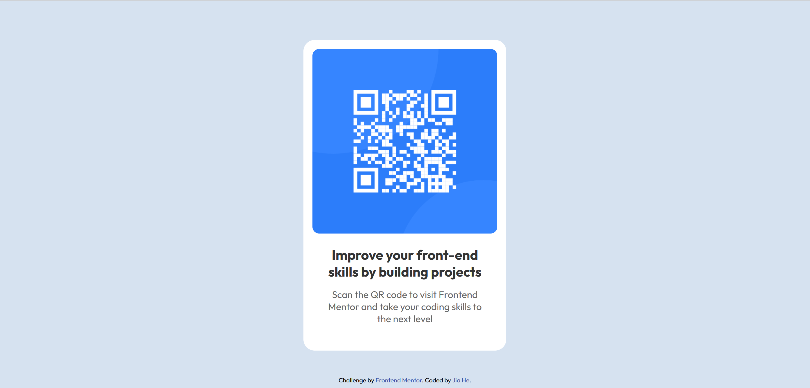

# QR code component solution

This is my solution to the [QR code component challenge on Frontend Mentor](https://www.frontendmentor.io/challenges/qr-code-component-iux_sIO_H). It's a great beginner project to practice basic HTML and CSS layout.

## Table of contents

- [Overview](#overview)
  - [Screenshot](#screenshot)
  - [Links](#links)
- [My process](#my-process)
  - [Built with](#built-with)
  - [What I learned](#what-i-learned)
  - [Continued development](#continued-development)
- [Author](#author)

## Overview

### Screenshot



### Links

- Solution URL: [My Github repo](https://github.com/JiaHe35354/QR-code-component/)
- Live Site URL: [https://qr-code-component-jiah.netlify.app/](https://qr-code-component-jiah.netlify.app/)

## My process

### Built with

- Semantic HTML5 markup
- CSS custom properties
- Flexbox
- Mobile-first workflow

### What I learned

This project helped me understand how to center a component using Flexbox and how to position a component to the bottom in the web page.

```css
body {
  font-family: "Outfit", sans-serif;
  background-color: hsl(212, 45%, 89%);
  height: 100vh;

  display: flex;
  justify-content: center;
  align-items: center;

  position: relative;
}

.attribution {
  position: absolute;
  bottom: 1rem;
}
```

### Continued development

In the future, I want to improve my layout and responsive design skills.

## Author

- Website - [Jia He](https://www.your-site.com)
- Frontend Mentor - [@JiaHe35354](https://www.frontendmentor.io/profile/JiaHe35354)
